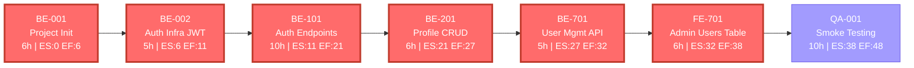
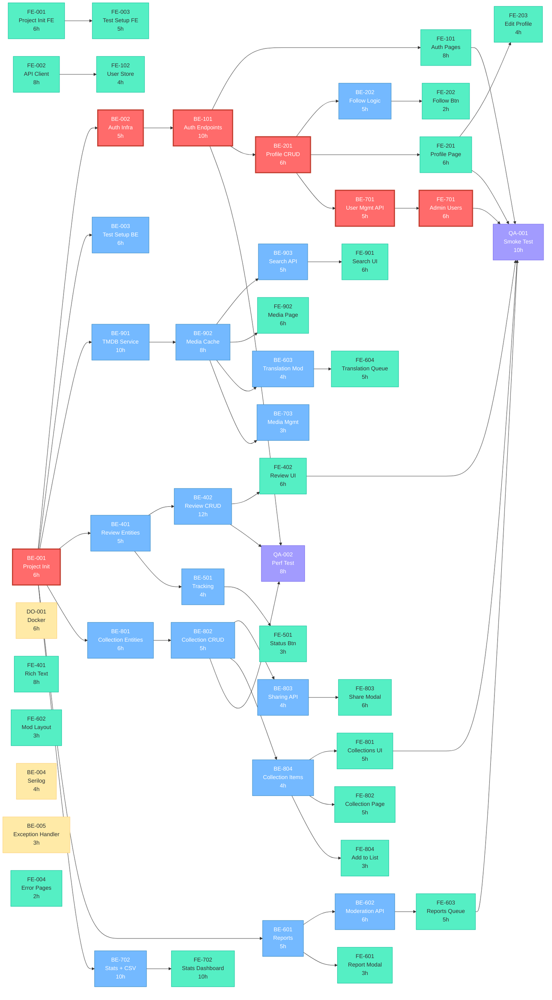

# Мережевий графік проекту Track List (Mermaid)

## 1. Критичний шлях (виділений)

**Тривалість критичного шляху: 48 людино-годин**

---

## 2. Повний мережевий графік

### Легенда

| Колір         | Значення                    |
| ------------- | --------------------------- |
| 🔴 Червоний   | Критичний шлях (резерв = 0) |
| 🔵 Синій      | Backend задачі              |
| 🟢 Зелений    | Frontend задачі             |
| 🟡 Жовтий     | Інфраструктура              |
| 🟣 Фіолетовий | QA/Тестування               |
