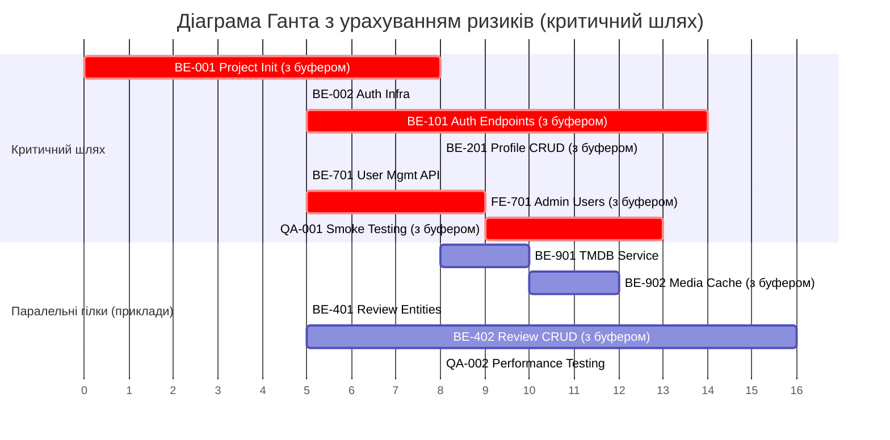

```mermaid
gantt
    title Діаграма Ганта з урахуванням ризиків (критичний шлях)
    dateFormat X
    axisFormat %s

    section Критичний шлях
    BE-001 Project Init (з буфером)     :crit, be001, 0, 8
    BE-002 Auth Infra                   :crit, be002, after be001, 5
    BE-101 Auth Endpoints (з буфером)   :crit, be101, after be002, 14
    BE-201 Profile CRUD (з буфером)     :crit, be201, after be101, 8
    BE-701 User Mgmt API               :crit, be701, after be201, 5
    FE-701 Admin Users (з буфером)      :crit, fe701, after be701, 9
    QA-001 Smoke Testing (з буфером)    :crit, qa001, after fe701, 13

    section Паралельні гілки (приклади)
    BE-901 TMDB Service                 :be901, after be001, 10
    BE-902 Media Cache (з буфером)      :be902, after be901, 12
    BE-401 Review Entities              :be401, after be001, 5
    BE-402 Review CRUD (з буфером)      :be402, after be401, 16
    QA-002 Performance Testing          :qa002, after be101, 8
```
